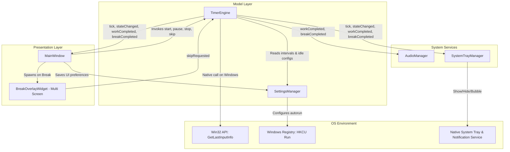
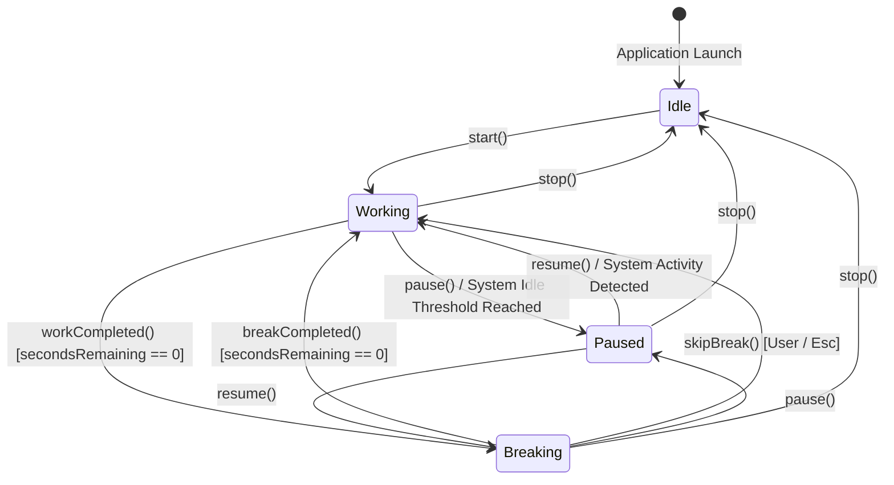
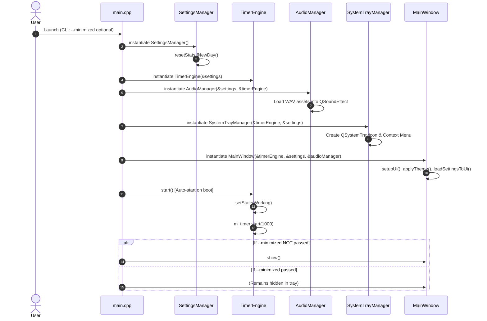
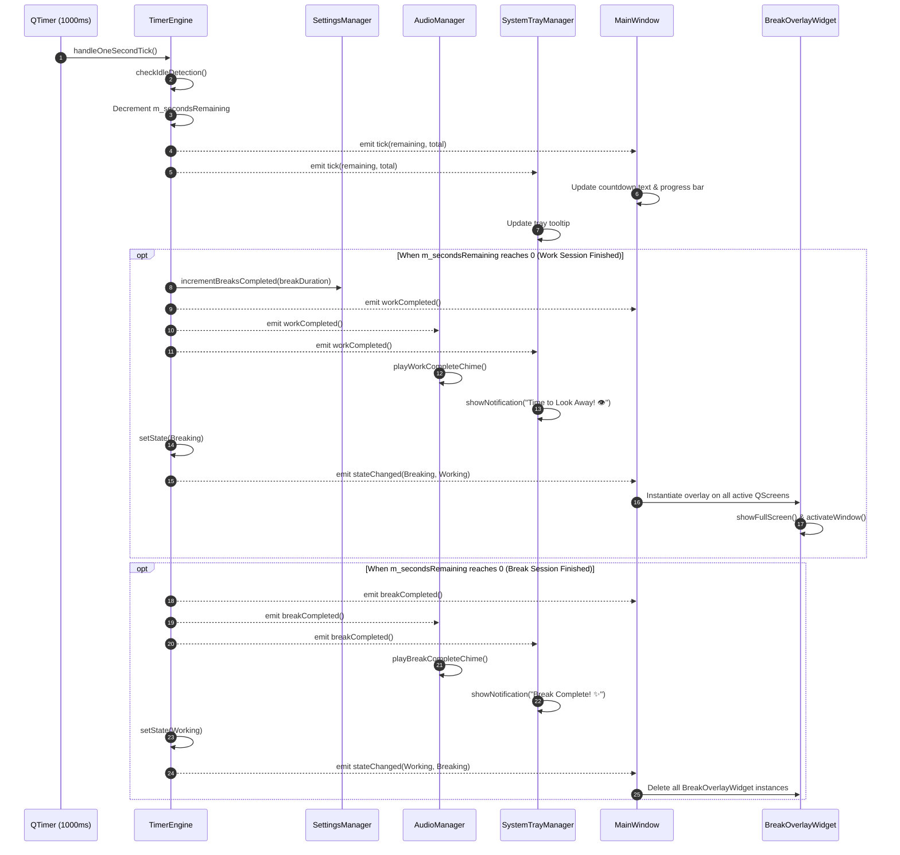
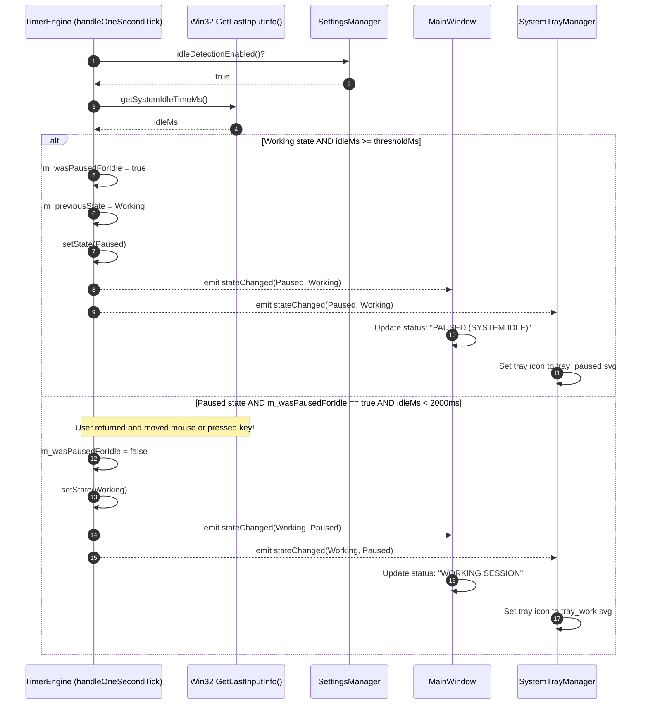
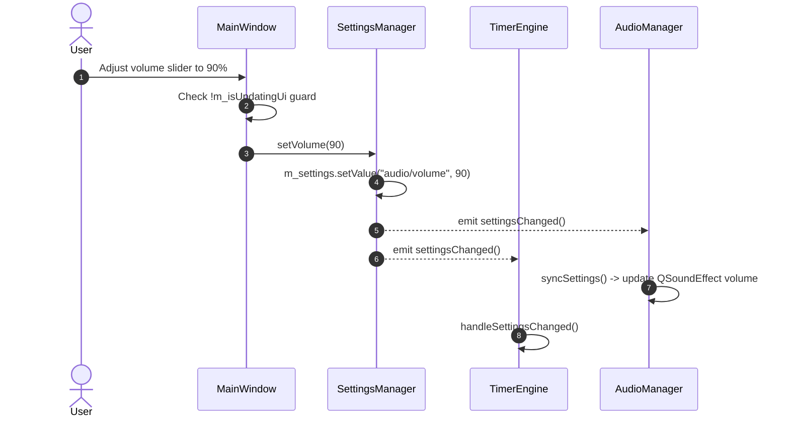

# LookAway Developer's Guide & Architecture Documentation

## Table of Contents
1. [Project Overview & Philosophy](#1-project-overview--philosophy)
2. [Technology Stack & System Requirements](#2-technology-stack--system-requirements)
3. [Repository Structure](#3-repository-structure)
4. [High-Level Architectural Blueprint](#4-high-level-architectural-blueprint)
5. [Core Data Structures & Class Models](#5-core-data-structures--class-models)
   - [5.1 TimerEngine & Finite State Machine](#51-timerengine--finite-state-machine)
   - [5.2 SettingsManager & Data Persistence](#52-settingsmanager--data-persistence)
   - [5.3 AudioManager & Audio Pipeline](#53-audiomanager--audio-pipeline)
   - [5.4 BreakOverlayWidget & Display Architecture](#54-breakoverlaywidget--display-architecture)
   - [5.5 SystemTrayManager & System Integration](#55-systemtraymanager--system-integration)
   - [5.6 MainWindow & Presentation Layer](#56-mainwindow--presentation-layer)
6. [System Workflows & Sequence Diagrams](#6-system-workflows--sequence-diagrams)
   - [6.1 Bootstrapping & Composition Root](#61-bootstrapping--composition-root)
   - [6.2 Timer Engine Tick & State Transition Workflow](#62-timer-engine-tick--state-transition-workflow)
   - [6.3 Smart Idle Detection & Resumption Workflow](#63-smart-idle-detection--resumption-workflow)
   - [6.4 Multi-Monitor Break Overlay Lifecycle](#64-multi-monitor-break-overlay-lifecycle)
   - [6.5 Settings Synchronization Workflow](#65-settings-synchronization-workflow)
   - [6.6 Application Exit & Close-To-Tray Workflow](#66-application-exit--close-to-tray-workflow)
7. [Cross-Platform Implementation & OS Integrations](#7-cross-platform-implementation--os-integrations)
   - [7.1 Win32 Native Idle Detection](#71-win32-native-idle-detection)
   - [7.2 Windows Auto-Run Registry Integration](#72-windows-auto-run-registry-integration)
   - [7.3 Linux & Wayland / X11 Considerations](#73-linux--wayland--x11-considerations)
8. [Configuration & Schema Reference](#8-configuration--schema-reference)
9. [Build, Test, and Packaging Pipeline](#9-build-test-and-packaging-pipeline)
   - [9.1 CMake Build Configuration](#91-cmake-build-configuration)
   - [9.2 Building on Windows (MinGW / MSVC)](#92-building-on-windows-mingw--msvc)
   - [9.3 Building on Linux](#93-building-on-linux)
   - [9.4 Creating Windows Installer (Inno Setup)](#94-creating-windows-installer-inno-setup)
   - [9.5 Creating Linux AppImage](#95-creating-linux-appimage)
10. [Styling & Design System (QSS)](#10-styling--design-system-qss)
11. [Extending LookAway (Developer Cookbook)](#11-extending-lookaway-developer-cookbook)

---

## 1. Project Overview & Philosophy

**LookAway** is an open-source, resource-efficient cross-platform desktop application built with **C++17** and **Qt 6**. Its primary goal is to enforce ocular ergonomics—specifically the clinically recognized **20-20-20 rule**:
> *Every 20 minutes of near work, look at an object at least 20 feet (6 meters) away for a minimum of 20 seconds.*

### Core Design Pillars
1. **Zero-Friction Ergonomics:** Runs unobtrusively in the system tray, consuming minimal RAM (< 35 MB) and negligible CPU (< 0.1%).
2. **Deterministic State Machine:** All timing events, pauses, resets, and skips are driven by a single-threaded Qt event loop state machine without background thread race conditions.
3. **Smart Inactivity Detection:** Prevents annoying prompts when the user has already stepped away from their workstation by tracking hardware idle time.
4. **Multi-Display Coverage:** Full-screen translucent overlays shield all active monitors during breaks, preventing accidental screen viewing while maintaining an escape hatch.

---

## 2. Technology Stack & System Requirements

| Domain | Technology / Specification | Purpose |
| :--- | :--- | :--- |
| **Language** | C++17 (ISO/IEC 14882:2017) | Modern C++ syntax, type safety, lambda expressions, RAII |
| **Core Framework** | Qt 6.x (`QtCore`, `QtGui`, `QtWidgets`) | Cross-platform UI widgets, event loop, signals/slots, system tray |
| **Multimedia Engine** | Qt 6 Multimedia (`Qt6::Multimedia`) | Low-latency audio chime playback via `QSoundEffect` |
| **Build Automation** | CMake 3.16+ (`Ninja` or `GNU Make`) | Cross-platform build script generation, `AUTOMOC`, `AUTORCC` |
| **Resource Bundling** | Qt Resource System (`rcc`) | Compiled binary embedding of SVG vector icons and WAV audio |
| **Windows Packaging** | Inno Setup 6.x | Windows installer creation (`.exe`), Start Menu & Registry hooks |
| **Linux Packaging** | AppImage (`appimagetool` / `linuxdeployqt`) | Self-contained, portable single-file binary distribution |
| **Target Platforms** | Windows 10/11 (x86_64), Linux (X11 & Wayland) | Primary desktop OS environments |

---

## 3. Repository Structure

```
LookAway/
├── CMakeLists.txt              # Root CMake project definition and compilation flags
├── README.md                   # User-facing summary, installation, and usage
├── LICENSE                     # MIT Open Source License
├── DEVELOPER_GUIDE.md          # Comprehensive architecture & developer documentation
├── installer/
│   └── setup_script.iss        # Inno Setup 6 configuration script for Windows packaging
├── src/
│   ├── main.cpp                # Application entry point, CLI arguments, and composition root
│   ├── TimerEngine.h           # FSM definition and state management declarations
│   ├── TimerEngine.cpp         # FSM timer logic, Win32 idle monitoring, countdown ticks
│   ├── SettingsManager.h       # QSettings interface and daily stats tracking declarations
│   ├── SettingsManager.cpp     # Configuration persistence, daily reset checks, registry hooks
│   ├── AudioManager.h          # QSoundEffect audio engine declarations
│   ├── AudioManager.cpp        # Sound loading from resources, volume scaling, chime dispatch
│   ├── BreakOverlayWidget.h    # Full-screen / Popup break shield widget declarations
│   ├── BreakOverlayWidget.cpp  # Overlay visual layout, countdown render, Esc key capture
│   ├── CustomPresetDialog.h    # Custom profile creation/edit dialog declarations
│   ├── CustomPresetDialog.cpp  # Custom preset form, validation, and duration conversion
│   ├── SystemTrayManager.h     # System tray controller declarations
│   ├── SystemTrayManager.cpp   # QSystemTrayIcon menu, tooltip updates, balloon notifications
│   ├── MainWindow.h            # Main dashboard and settings window declarations
│   └── MainWindow.cpp          # Dual-tab UI construction, QSS dark theme, data-binding
└── resources/
    ├── resources.qrc           # Qt Resource XML definition
    ├── icons/
    │   ├── app_icon.svg        # LookAway primary application icon (Eye motif)
    │   ├── tray_work.svg       # Tray status icon: Blue ring (Working session)
    │   ├── tray_break.svg      # Tray status icon: Amber ring (Break session)
    │   └── tray_paused.svg     # Tray status icon: Gray ring (Paused session)
    └── sounds/
        ├── chime_work.wav      # Audio chime announcing break commencement
        └── chime_break.wav     # Audio chime announcing work resumption
```

---

## 4. High-Level Architectural Blueprint

LookAway follows a decoupled, event-driven **Reactive Model-View-Controller (MVC) / Mediator** architectural pattern leveraging the Qt Meta-Object System (Signals and Slots).



### Architectural Characteristics:
1. **Single Owner Composition Root:** All singleton-like components (`SettingsManager`, `TimerEngine`, `AudioManager`, `SystemTrayManager`, `MainWindow`) are instantiated once in `main.cpp` on the stack.
2. **Loose Coupling via Signals & Slots:** None of the views directly mutate each other. State changes emit Qt signals (`stateChanged`, `tick`, `settingsChanged`, `statsUpdated`).
3. **No Heavy Threads:** Concurrency is achieved through non-blocking asynchronous timers on the main GUI event loop, eliminating threading deadlocks or race conditions.

---

## 5. Core Data Structures & Class Models

### 5.1 TimerEngine & Finite State Machine

[TimerEngine](file:///home/adarsh/Desktop/ad_desk/Projects/LookAway/src/TimerEngine.h) controls the countdown lifecycle and state progression.

#### Finite State Machine States
```cpp
enum class State {
    Idle,      // Timer stopped, waiting for user to start
    Working,   // User work countdown active (e.g., 20 mins)
    Breaking,  // Rest break countdown active (e.g., 20 secs)
    Paused     // Suspended manually or automatically due to system idle
};
Q_ENUM(State)
```



#### Member Data Structures
| Member Variable | Type | Description |
| :--- | :--- | :--- |
| `m_settings` | `SettingsManager*` | Non-owning pointer to configuration model |
| `m_timer` | `QTimer` | 1000ms periodic timer driving `handleOneSecondTick()` |
| `m_state` | `TimerEngine::State` | Current active operational state |
| `m_previousState` | `TimerEngine::State` | Retains previous state (Working vs Breaking) during pause |
| `m_secondsRemaining` | `int` | Countdown counter decrementing each second |
| `m_totalDurationSeconds` | `int` | Denominator used for progress bar percentage calculations |
| `m_wasPausedForIdle` | `bool` | Flag designating that the pause was triggered by inactivity |

---

### 5.2 SettingsManager & Data Persistence

[SettingsManager](file:///home/adarsh/Desktop/ad_desk/Projects/LookAway/src/SettingsManager.h) wraps `QSettings` to provide persistent state across reboots and manages daily analytical metrics.

#### Internal Configuration Storage
Persistent keys are written using native formats:
- **Windows:** Registry path `HKEY_CURRENT_USER\Software\LookAway\LookAwayApp`
- **Linux:** INI text file `~/.config/LookAway/LookAwayApp.conf`

#### Data Dictionary
```cpp
// Schema: Group/Key -> Default Value
"timer/workDuration"       : 1200 (int seconds -> 20 mins)
"timer/breakDuration"      : 20   (int seconds)
"audio/enabled"            : true (bool)
"audio/volume"             : 80   (int percentage: 0..100)
"notifications/enabled"    : true (bool)
"ui/closeToTray"           : true (bool)
"ui/strictMode"            : true (bool, enables full-screen overlays)
"system/autostart"         : false (bool)
"system/idleDetection"     : true (bool)
"system/idleThreshold"     : 180  (int seconds -> 3 mins)
"stats/lastResetDate"      : "YYYY-MM-DD" (QString ISO date)
"stats/completedToday"     : 0 (int count)
"stats/skippedToday"       : 0 (int count)
"stats/eyeRestSecondsToday": 0 (int cumulative seconds)
```

#### Daily Analytics Rollover Logic
Every mutation of metrics queries `resetStatsIfNewDay()`:
```cpp
void SettingsManager::resetStatsIfNewDay() {
    QString todayStr = QDate::currentDate().toString(Qt::ISODate);
    QString lastReset = m_settings.value("stats/lastResetDate", "").toString();
    if (lastReset != todayStr) {
        m_settings.setValue("stats/lastResetDate", todayStr);
        m_settings.setValue("stats/completedToday", 0);
        m_settings.setValue("stats/skippedToday", 0);
        m_settings.setValue("stats/eyeRestSecondsToday", 0);
        emit statsUpdated();
    }
}

void SettingsManager::resetDailyStats() {
    m_settings.setValue("stats/completedToday", 0);
    m_settings.setValue("stats/skippedToday", 0);
    m_settings.setValue("stats/eyeRestSecondsToday", 0);
    emit statsUpdated();
}

void SettingsManager::resetAllToDefaults() {
    setWorkDurationSeconds(1200);
    setBreakDurationSeconds(20);
    setAudioEnabled(true);
    setVolume(80);
    setNotificationsEnabled(true);
    setBreakWindowEnabled(true);
    setBreakWindowStyle("popup");
    setCloseToTray(true);
    setAutostart(false);
    setIdleDetectionEnabled(true);
    setIdleThresholdSeconds(180);
    setActivePresetName("20-20-20");
    resetDailyStats();
    emit settingsChanged();
}
```


---

### 5.3 AudioManager & Audio Pipeline

[AudioManager](file:///home/adarsh/Desktop/ad_desk/Projects/LookAway/src/AudioManager.h) provides low-latency notification chimes using `Qt6::Multimedia`'s `QSoundEffect`.

- **Instances:** `QSoundEffect m_workSound` (bound to `qrc:/sounds/chime_work.wav`), `QSoundEffect m_breakSound` (bound to `qrc:/sounds/chime_break.wav`).
- **Volume Normalization:** Converts integer volume (0..100) to linear floating-point scalar (0.0f..1.0f):
  $$\text{Volume}_{\text{normalized}} = \frac{\text{volume}_{\text{int}}}{100.0}$$
- **Event Listeners:** Automatically connects to `TimerEngine::workCompleted` and `TimerEngine::breakCompleted`.

---

### 5.4 BreakOverlayWidget & Display Architecture

[BreakOverlayWidget](file:///home/adarsh/Desktop/ad_desk/Projects/LookAway/src/BreakOverlayWidget.h) provides visual shielding during rest breaks with two selectable presentation modes:
- **`DisplayMode::FullScreen`:** Spans semi-transparent backdrop overlays across all active monitors (`rgba(15, 23, 42, 235)`).
- **`DisplayMode::CenteredPopup`:** Spawns a floating card ($460 \times 320$ px) centered on the primary monitor. Features draggable repositioning via `mousePressEvent` / `mouseMoveEvent`, leaving the rest of the desktop visible.

#### Window Composition & Window Flags
```cpp
BreakOverlayWidget::BreakOverlayWidget(DisplayMode mode, QWidget* parent)
    : QWidget(parent, Qt::FramelessWindowHint | Qt::WindowStaysOnTopHint | Qt::Tool),
      m_mode(mode) {
    setAttribute(Qt::WA_TranslucentBackground);
    setFocusPolicy(Qt::StrongFocus);
    setupUi();
}
```
- `Qt::FramelessWindowHint`: Removes OS title bar, minimize, and close controls.
- `Qt::WindowStaysOnTopHint`: Pins the overlay above normal client windows.
- `Qt::Tool`: Prevents the overlay window from creating separate taskbar entries.
- `Qt::WA_TranslucentBackground`: Allows clean alpha-channel rounded borders and semi-transparent rendering.

#### Event Filtering & Keyboard Interception
To provide an intentional user escape hatch without breaking focus, `keyPressEvent` filters the `Escape` key:
```cpp
void BreakOverlayWidget::keyPressEvent(QKeyEvent* event) {
    if (event->key() == Qt::Key_Escape) {
        emit skipRequested();
    } else {
        QWidget::keyPressEvent(event);
    }
}
```

---

### 5.5 CustomPresetDialog & Profile Management

[CustomPresetDialog](file:///home/adarsh/Desktop/ad_desk/Projects/LookAway/src/CustomPresetDialog.h) provides a focused dialog to create and edit named profiles:
- Automatically pre-populates with the exact work and break durations currently configured in the Settings inputs or running timer.
- Converts between human-friendly units (`Seconds`, `Minutes`, `Hours`) and raw integer seconds.
- Persists custom profiles into `QSettings` via `SettingsManager::saveCustomPreset()`.


---

### 5.6 SystemTrayManager & System Integration

[SystemTrayManager](file:///home/adarsh/Desktop/ad_desk/Projects/LookAway/src/SystemTrayManager.h) provides persistent shell interaction via `QSystemTrayIcon` and a dynamic context menu (`QMenu`).

#### Context Menu Layout
```
[LookAway Icon] Show Dashboard  --> triggers showDashboardRequested()
----------------------------------
[Play / Pause / Resume]         --> dynamically updates label & icon based on FSM
[Skip Break]                    --> enabled only in Breaking or Paused(from Breaking)
Settings...                     --> triggers showSettingsRequested()
----------------------------------
Quit LookAway                   --> terminates QCoreApplication
```

#### Dynamic Tray Icon & Tooltip Pipeline
Every second during a tick or upon an FSM transition:
1. Icon flips between `tray_work.svg`, `tray_break.svg`, and `tray_paused.svg`.
2. Tooltip updates formatted time:
   ```
   LookAway - Work Session
   19:42 remaining
   ```
3. Native system notifications are dispatched on session completions using `showMessage()` with a 5000ms duration.

---

### 5.6 MainWindow & Presentation Layer

[MainWindow](file:///home/adarsh/Desktop/ad_desk/Projects/LookAway/src/MainWindow.h) is a fixed-size ($460 \times 580$ px) tabbed control panel.

#### Tab 0: Dashboard
- **Header:** Branded icon and title.
- **Status Badge:** High-contrast contextual pills:
  - Working: Sky Blue (`#0284c7`)
  - Breaking: Amber (`#d97706`)
  - Paused: Slate (`#475569`)
  - Idle: Dark Slate (`#334155`)
- **Timer Card:** Monospace countdown display (`50px`) and smooth progress bar.
- **Controls:** `Start / Pause / Resume`, `Reset`, `Skip Break`.
- **Preset Quick-Pickers:** One-click configurations:
  - `20-20-20` (20m work, 20s break)
  - `25-5 Pomo` (25m work, 300s break)
  - `50-10 Work` (50m work, 600s break)
- **Analytics Widget:** Live counters for completed breaks, skipped breaks, and minutes of eye rest.

#### Tab 1: Settings
- **Durations:** Hybrid value/unit editable comboboxes supporting Seconds, Minutes, and Hours.
- **Feedback & Strictness:** Audio chimes toggle, volume slider with live test button, desktop notifications toggle, full-screen strict mode toggle.
- **System Behavior:** Close to tray toggle, Windows autorun toggle, idle detection toggle with threshold duration selector.

---

## 6. System Workflows & Sequence Diagrams

### 6.1 Bootstrapping & Composition Root



---

### 6.2 Timer Engine Tick & State Transition Workflow



---

### 6.3 Smart Idle Detection & Resumption Workflow

This mechanism prevents artificial countdowns when a user has walked away from their desk.



---

### 6.4 Multi-Monitor Break Overlay Lifecycle

When entering `State::Breaking`, LookAway identifies every attached monitor to ensure the overlay cannot be circumvented by simply glancing at an auxiliary display.

```mermaid
sequenceDiagram
    autonumber
    participant MW as MainWindow
    participant QGui as QGuiApplication
    participant BO as BreakOverlayWidget
    participant TE as TimerEngine

    MW->>QGui: screens()
    QGui-->>MW: QList<QScreen*> screens
    loop For each screen in screens
        create participant BO
        MW->>BO: new BreakOverlayWidget()
        MW->>BO: connect skipRequested -> TimerEngine::skipBreak
        MW->>BO: setGeometry(screen->geometry())
        MW->>BO: showFullScreen(), raise(), activateWindow()
    end
    
    loop Every second during break
        TE-->>MW: tick(secondsRemaining, totalSeconds)
        MW->>BO: updateCountdown(secondsRemaining, totalSeconds)
    end

    alt User hits 'Esc' or clicks 'Skip Break'
        BO-->>MW: emit skipRequested()
        MW->>TE: skipBreak()
        TE->>TE: incrementBreaksSkipped()
        TE->>TE: setState(Working)
    end

    MW->>BO: qDeleteAll(m_breakOverlays)
```

---

### 6.5 Settings Synchronization Workflow

LookAway implements instant auto-save. Any change to a spinbox, combobox, slider, or checkbox immediately updates `QSettings` without requiring a "Save" or "Apply" button.



---

### 6.6 Application Exit & Close-To-Tray Workflow

```mermaid
sequenceDiagram
    autonumber
    actor User
    participant MW as MainWindow
    participant SM as SettingsManager
    participant TM as SystemTrayManager
    participant App as QApplication

    alt User clicks window titlebar 'X'
        User->>MW: closeEvent(e)
        MW->>SM: closeToTray()?
        alt closeToTray is true (Default)
            MW->>MW: e->ignore()
            MW->>MW: hide()
            Note over MW: Application stays active in system tray
        else closeToTray is false
            MW->>MW: e->accept()
            MW->>App: quit()
        end
    else User selects "Quit LookAway" from Tray Menu
        User->>TM: Click "Quit LookAway"
        TM->>App: quit()
        App->>MW: Destructors called
        App->>App: Exit 0
    end
```



---

## 7. Cross-Platform Implementation & OS Integrations

### 7.1 Win32 Native Idle Detection

On Windows systems, LookAway uses the Win32 `GetLastInputInfo` API to query hardware input events across the entire desktop (regardless of which process has window focus).

```cpp
#ifdef Q_OS_WIN
#include <windows.h>

static qint64 getSystemIdleTimeMs() {
    LASTINPUTINFO lii;
    lii.cbSize = sizeof(LASTINPUTINFO);
    if (GetLastInputInfo(&lii)) {
        DWORD tickCount = GetTickCount();
        return static_cast<qint64>(tickCount - lii.dwTime);
    }
    return 0;
}
#endif
```

#### Architecture Details:
- `LASTINPUTINFO`: Win32 struct populated with `dwTime` (the millisecond tick count of the last user keyboard or mouse input).
- `GetTickCount()`: Returns uptime milliseconds.
- Elapsed difference $\Delta t = \text{GetTickCount()} - \text{lii.dwTime}$.
- If $\Delta t \ge \text{Threshold}$ (default 180,000 ms), the application transitions to `Paused`.
- Upon user return, when $\Delta t < 2,000\text{ ms}$, the session automatically unpauses.

---

### 7.2 Windows Auto-Run Registry Integration

Autostart on user logon is controlled via standard Windows Registry hooks in `SettingsManager.cpp`:

```cpp
#ifdef Q_OS_WIN
void SettingsManager::applyAutostart(bool enabled) {
    QSettings autoRunSettings(
        "HKEY_CURRENT_USER\\Software\\Microsoft\\Windows\\CurrentVersion\\Run", 
        QSettings::NativeFormat
    );
    QString appPath = QDir::toNativeSeparators(QCoreApplication::applicationFilePath());
    if (enabled) {
        autoRunSettings.setValue("LookAway", "\"" + appPath + "\" --minimized");
    } else {
        autoRunSettings.remove("LookAway");
    }
}
#endif
```

When enabled, Windows launches LookAway at startup with the `--minimized` flag, placing it directly into the tray without popping open the configuration window.

---

### 7.3 Linux & Wayland / X11 Considerations

- **X11:** `Qt::WindowStaysOnTopHint` and full-screen geometries operate reliably across multi-monitor setups.
- **Wayland:** Under Wayland, application windows are isolated by the compositor (e.g., Mutter, KWin). Some compositors restrict window positioning or `StaysOnTop` manipulation by client applications for security reasons. LookAway relies on standard Qt 6 Wayland shell integration protocols (`xdg-shell` / `wlr-layer-shell`).
- **Linux Idle Detection:** Win32 APIs are disabled on Linux via conditional compilation (`#ifdef Q_OS_WIN`). In Linux builds, `checkIdleDetection()` is currently a no-op. (See [Section 11](#11-extending-lookaway-developer-cookbook) for adding DBus or XScreenSaver idle detection).

---

## 8. Configuration & Schema Reference

All settings are encapsulated within `SettingsManager`. Below is the complete schema:

| Group | Key | Type | Default | Permissible Range | Description |
| :--- | :--- | :--- | :--- | :--- | :--- |
| `timer` | `workDuration` | `int` | `1200` | $1 \le x \le 86400$ | Length of working session in seconds |
| `timer` | `breakDuration`| `int` | `20` | $1 \le x \le 3600$ | Length of break session in seconds |
| `audio` | `enabled` | `bool` | `true` | `true / false` | Master audio chime toggle |
| `audio` | `volume` | `int` | `80` | $0 \le x \le 100$ | Output audio volume percentage |
| `notifications` | `enabled` | `bool` | `true` | `true / false` | Desktop tray toast notifications |
| `ui` | `closeToTray` | `bool` | `true` | `true / false` | Intercept window close to minimize to tray |
| `ui` | `strictMode` | `bool` | `true` | `true / false` | Spawns full-screen shield overlay during breaks |
| `system` | `autostart` | `bool` | `false` | `true / false` | Enables OS startup launch hook |
| `system` | `idleDetection`| `bool` | `true` | `true / false` | Automatically pauses timer when idle |
| `system` | `idleThreshold`| `int` | `180` | $30 \le x \le 3600$ | Seconds of zero input required to trigger idle |
| `stats` | `lastResetDate`| `QString`| `""` | ISO Date String | Last reset date (`YYYY-MM-DD`) for analytics |
| `stats` | `completedToday`| `int` | `0` | $\ge 0$ | Number of completed breaks today |
| `stats` | `skippedToday` | `int` | `0` | $\ge 0$ | Number of skipped breaks today |
| `stats` | `eyeRestSecondsToday`| `int` | `0` | $\ge 0$ | Total eye rest seconds logged today |

---

## 9. Build, Test, and Packaging Pipeline

### 9.1 CMake Build Configuration

The project uses modern modular CMake with target-based properties:

```cmake
cmake_minimum_required(VERSION 3.16)
project(LookAway VERSION 1.0.0 LANGUAGES CXX)

set(CMAKE_CXX_STANDARD 17)
set(CMAKE_CXX_STANDARD_REQUIRED ON)

set(CMAKE_AUTOMOC ON) # Auto-generates Qt Meta-Object code
set(CMAKE_AUTORCC ON) # Compiles resources.qrc into binary
set(CMAKE_AUTOUIC ON) # Compiles UI forms if added

find_package(Qt6 REQUIRED COMPONENTS Widgets Multimedia)

set(SOURCES
    src/main.cpp
    src/TimerEngine.h
    src/TimerEngine.cpp
    src/SettingsManager.h
    src/SettingsManager.cpp
    src/AudioManager.h
    src/AudioManager.cpp
    src/SystemTrayManager.h
    src/SystemTrayManager.cpp
    src/BreakOverlayWidget.h
    src/BreakOverlayWidget.cpp
    src/MainWindow.h
    src/MainWindow.cpp
    resources/resources.qrc
)

add_executable(LookAway ${SOURCES})
target_link_libraries(LookAway PRIVATE Qt6::Widgets Qt6::Multimedia)

if(WIN32)
    set_target_properties(LookAway PROPERTIES WIN32_EXECUTABLE TRUE)
endif()
```

---

### 9.2 Building on Windows (MinGW / MSVC)

#### 1. Setup Build Environment
Ensure Qt 6 (Widgets & Multimedia modules) and CMake are installed.

```powershell
# In PowerShell:
git clone https://github.com/itsrajadarsh/LookAway.git
cd LookAway

# Configure with CMake (pointing to Qt6 installation path)
cmake -B build -G "Ninja" -DCMAKE_PREFIX_PATH="C:/Qt/6.8.3/mingw_64" -DCMAKE_BUILD_TYPE=Release

# Compile
cmake --build build --config Release
```

#### 2. Deploy Dependencies (`windeployqt`)
Before running outside of Qt Creator, copy all required Qt DLLs and plugins into the build directory:
```powershell
windeployqt build/LookAway.exe --multimedia
```

---

### 9.3 Building on Linux

#### 1. Install Dependencies (Ubuntu/Debian)
```bash
sudo apt update
sudo apt install build-essential cmake ninja-build \
                 qt6-base-dev qt6-multimedia-dev \
                 libgl1-mesa-dev
```

#### 2. Compile
```bash
git clone https://github.com/itsrajadarsh/LookAway.git
cd LookAway

cmake -B build -G Ninja -DCMAKE_BUILD_TYPE=Release
cmake --build build
```

#### 3. Run
```bash
./build/LookAway
# Or start minimized directly into system tray:
./build/LookAway --minimized
```

---

### 9.4 Creating Windows Installer (Inno Setup)

LookAway includes a production-ready Inno Setup configuration at [installer/setup_script.iss](file:///home/adarsh/Desktop/ad_desk/Projects/LookAway/installer/setup_script.iss).

1. Execute `windeployqt build/LookAway.exe`.
2. Compile the installer:
   ```cmd
   "C:\Program Files (x86)\Inno Setup 6\ISCC.exe" installer\setup_script.iss
   ```
3. The resulting standalone setup binary is emitted to:
   `installer_output/windows/LookAway-Setup-v1.0.0.exe`

Features configured by `setup_script.iss`:
- Modern wizard styling, lowest privilege execution (no administrator elevation required).
- Optional desktop icon creation.
- Optional system startup autostart registry insertion.
- Complete uninstaller generation with clean registry cleanup (`uninsdeletevalue`).

---

### 9.5 Creating Linux AppImage

To package LookAway as a standalone `.AppImage` for distribution on any modern Linux distribution:

```bash
# 1. Create AppDir layout
mkdir -p AppDir/usr/bin
mkdir -p AppDir/usr/share/icons/hicolor/scalable/apps
mkdir -p AppDir/usr/share/applications

# 2. Copy binary and desktop assets
cp build/LookAway AppDir/usr/bin/
cp resources/icons/app_icon.svg AppDir/usr/share/icons/hicolor/scalable/apps/lookaway.svg
cp resources/icons/app_icon.svg AppDir/lookaway.svg

# 3. Create Desktop Entry
cat <<EOF > AppDir/lookaway.desktop
[Desktop Entry]
Name=LookAway
Exec=LookAway
Icon=lookaway
Type=Application
Categories=Utility;Clock;
Comment=20-20-20 Eye Care Background Utility
Terminal=false
EOF

# 4. Run linuxdeployqt or appimagetool
linuxdeployqt AppDir/usr/bin/LookAway -appimage -qmake=/usr/lib/qt6/bin/qmake
```

---

## 10. Styling & Design System (QSS)

The UI uses a custom **Tailwind-inspired Slate & Sky Dark Palette** configured in `MainWindow::applyTheme()`.

### Color Palette Tokens
| Token | Hex Value | Application |
| :--- | :--- | :--- |
| **Canvas Background** | `#0f172a` (Slate-900) | Root window, input fields background |
| **Card / Surface** | `#1e293b` (Slate-800) | Tab panes, grouping containers |
| **Border / Divider** | `#334155` (Slate-700) | Outer outlines, input borders |
| **Muted Border** | `#475569` (Slate-600) | Checkbox boundaries, secondary hovers |
| **Text Primary** | `#f8fafc` (Slate-50) | Primary typography, headers |
| **Text Secondary** | `#94a3b8` (Slate-400) | Captions, stats descriptions, subtitles |
| **Primary Accent** | `#0284c7` (Sky-600) | Primary action buttons, badge accents |
| **Accent Hover** | `#0369a1` (Sky-700) | Button hover highlight |
| **Vibrant Highlight** | `#38bdf8` (Sky-400) | Digital timer readout, selection highlights |
| **Warning / Break** | `#d97706` (Amber-600) | Break status pill, skip stats counter |
| **Success / Rest** | `#10b981` (Emerald-500)| Completed rest minutes stat badge |

### Key QSS Rules
- **Modern Typography:** Prioritizes system font stack `'Segoe UI', system-ui, -apple-system, sans-serif` for controls and `'Consolas', 'Courier New', monospace` for countdown readouts.
- **Micro-Interactions:** Custom hover and pressed pseudo-classes (`:hover`, `:pressed`, `:checked`) on all buttons and checkboxes.
- **Custom Scrollbars & Combobox Views:** Dropdown list views styled with matching slate background and sky hover selection colors.

---

## 11. Extending LookAway (Developer Cookbook)

### How to Add a New Timer Preset
To add a new preset (e.g., 45-minute work session with 15-minute break):
1. Open [src/MainWindow.cpp](file:///home/adarsh/Desktop/ad_desk/Projects/LookAway/src/MainWindow.cpp#L152-L174).
2. Instantiate a new button in `createDashboardTab()`:
   ```cpp
   QPushButton* btnPreset45 = new QPushButton("45-15 Rest");
   btnPreset45->setObjectName("btnSmall");
   connect(btnPreset45, &QPushButton::clicked, [this]() { 
       applyPreset(45, 900); // 45 mins work, 900 secs (15 mins) break
   });
   presetLayout->addWidget(btnPreset45);
   ```

### How to Implement Linux / X11 Idle Detection
To extend idle detection beyond Windows, implement the X11 `XScreenSaver` extension:
1. In `CMakeLists.txt`, link `X11` and `Xext` on Unix:
   ```cmake
   if(UNIX AND NOT APPLE)
       find_package(X11 REQUIRED)
       target_link_libraries(LookAway PRIVATE ${X11_LIBRARIES} Xss)
   endif()
   ```
2. In [src/TimerEngine.cpp](file:///home/adarsh/Desktop/ad_desk/Projects/LookAway/src/TimerEngine.cpp#L4-L16), add:
   ```cpp
   #if defined(Q_OS_LINUX)
   #include <X11/Xlib.h>
   #include <X11/extensions/scrnsaver.h>

   static qint64 getSystemIdleTimeMs() {
       Display* display = XOpenDisplay(nullptr);
       if (!display) return 0;
       XScreenSaverInfo* info = XScreenSaverAllocInfo();
       XScreenSaverQueryInfo(display, DefaultRootWindow(display), info);
       qint64 idleMs = static_cast<qint64>(info->idle);
       XFree(info);
       XCloseDisplay(display);
       return idleMs;
   }
   #endif
   ```
3. Update `TimerEngine::checkIdleDetection()` to call `getSystemIdleTimeMs()` on both `Q_OS_WIN` and `Q_OS_LINUX`.

### How to Add New Notification Chimes
1. Place audio `.wav` files into `resources/sounds/`.
2. Register the files in [resources/resources.qrc](file:///home/adarsh/Desktop/ad_desk/Projects/LookAway/resources/resources.qrc).
3. Bind the resource URL in [src/AudioManager.cpp](file:///home/adarsh/Desktop/ad_desk/Projects/LookAway/src/AudioManager.cpp#L10-L11).
