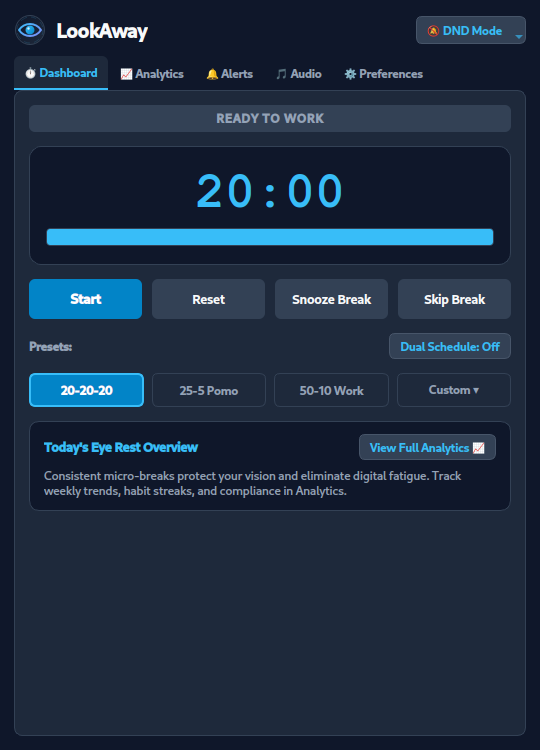
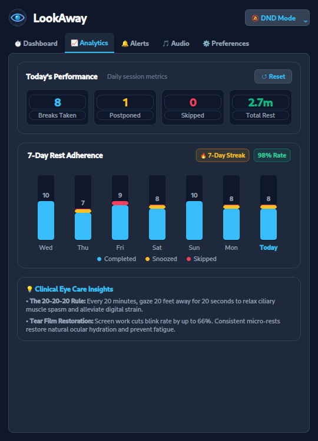
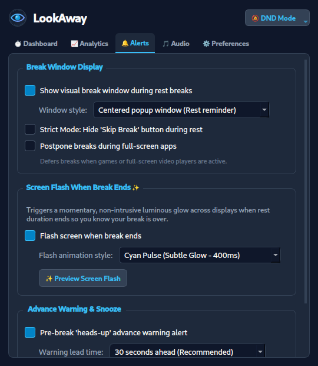
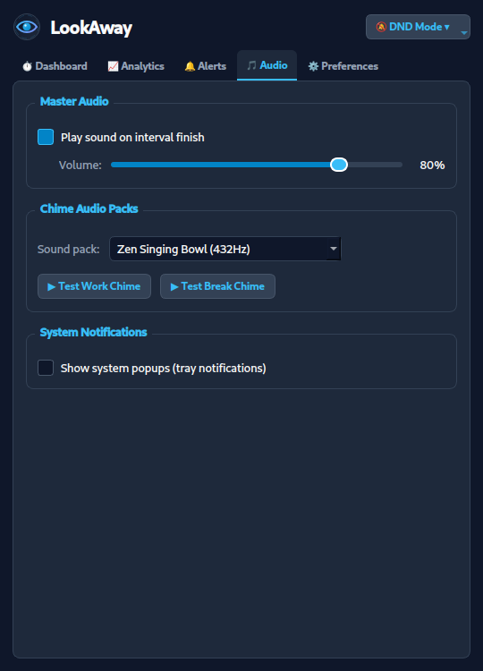
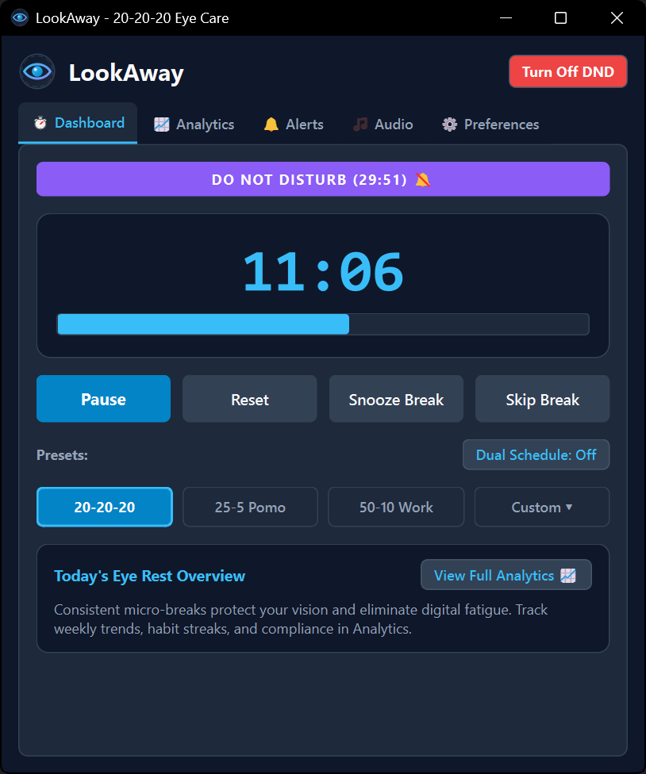
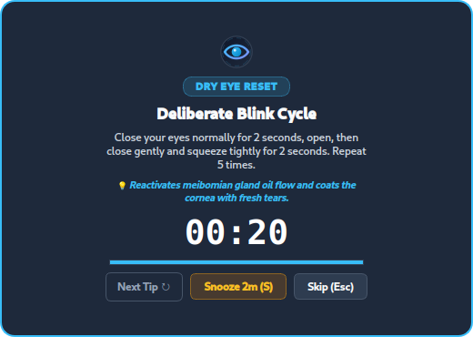
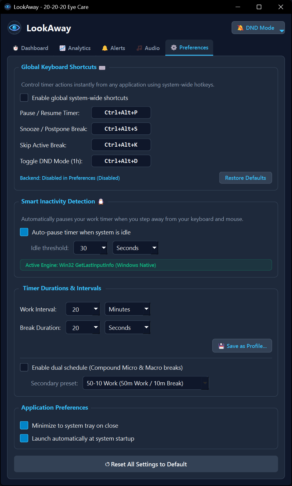
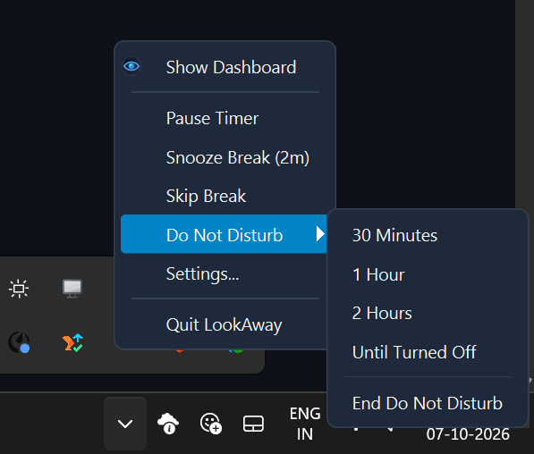

# LookAway

A lightweight, cross-platform desktop utility built with **C++17** and **Qt 6** to enforce the **20-20-20 eye care rule**: every 20 minutes of screen time, take a 20-second break to focus on an object at least 20 feet (6 meters) away.

---

## 📥 Downloads & Releases

Pre-compiled binaries for Windows and Linux are available on the [GitHub Releases](https://github.com/itsrajadarsh/LookAway/releases) page.

### Windows (Installer)
* **File:** `LookAway-Setup-v2.0.0.exe`
* **Installation:** Download and run the setup executable. Follow the installer wizard to install LookAway and optionally enable launch on system startup.

### Linux (AppImage)
* **File:** `LookAway-2.0.0-x86_64.AppImage` (or `LookAway-x86_64.AppImage`)
* **Execution:** Download the AppImage, make it executable, and run:
  ```bash
  chmod +x LookAway-2.0.0-x86_64.AppImage
  ./LookAway-2.0.0-x86_64.AppImage
  ```

---

## ✨ Features

* **Background Operation:** Runs quietly in the system tray with minimal CPU and memory footprint.
* **Global Keyboard Shortcuts (System-Wide Hotkeys):** Control your eye care timer instantly from any application using global hotkeys:
  * `Ctrl+Alt+P` — Pause / Resume Timer
  * `Ctrl+Alt+S` — Snooze / Postpone Break (1–5 minutes)
  * `Ctrl+Alt+K` — Skip Current Rest Break
  * `Ctrl+Alt+D` — Toggle 1-Hour Focus DND Mode
  * *Linux Support:* Active in-app via `Qt::ApplicationShortcut`, native global interception on X11, and seamless desktop shortcut commands on Wayland (`lookaway --toggle`, `lookaway --snooze`, `lookaway --skip`, `lookaway --dnd`).
* **Screen Flash When Break Ends ✨:** Momentary, non-intrusive luminous glow across all connected displays when your rest break completes (styles: Cyan Pulse, Amber Warmth, Pure White, Double Ripple) with instant preview.
* **Native Linux Wayland Idle Detection:** Seamless auto-pause and resume across modern Wayland and X11 compositors using native D-Bus integration (`org.gnome.Mutter.IdleMonitor`, `org.freedesktop.ScreenSaver`, `KIdleTime`), and Win32 `GetLastInputInfo` on Windows.
* **Modern 5-Tab Clean Interface:** Intuitive, de-cluttered layout organized across:
  * ⏱️ **Dashboard:** Live countdown, session progress bar, primary controls, preset selectors, and daily rest glance.
  * 📈 **Analytics:** Dedicated health analytics page featuring a 7-day adherence stacked bar chart, consecutive habit streaks (`🔥 N-Day Streak`), compliance rate, daily metrics, and clinical eye care guidelines.
  * 🔔 **Alerts & Visuals:** Break window styles (Popup, Border Glow, FullScreen), Screen Flash on finish, advance warning, and snooze timing.
  * 🎵 **Audio & Sounds:** Volume slider, 4 ambient chime theme packs (Digital, Zen 432Hz, Marimba, Bell), custom audio paths, and preview test buttons.
  * ⚙️ **Preferences & Shortcuts:** Global hotkey configuration, smart inactivity detection with live engine diagnostics, tray behavior, and custom interval profiles.
* **Meeting & Presentation "Do Not Disturb" (DND) Mode:** 1-click suppression of all break windows and audio with duration presets (30m, 1h, 2h, or Until Turned Off). Displays a live DND countdown badge and automatically resumes your eye care schedule.
* **Pre-Break Advance Warning:** Configurable "heads-up" notification 15–60 seconds ahead so you can seamlessly wrap up typing, editing, or calls before your rest period begins.
* **Postpone / Snooze Break:** Need a couple more minutes? Snooze your break by 1–5 minutes without counting it as skipped in your daily stats.
* **Guided Ergonomic Exercises & Stretches:** Rotating clinical library of 10 targeted exercises (ciliary muscle relaxation, deliberate blink cycle, pencil push-ups, chin tucks, and posture stretches) with an interactive **"Next Tip ↻"** switcher.
* **Multi-Day / Weekly Analytics & Habit Streaks:** Dedicated 7-day adherence stacked bar chart with day hover cards, tracking Breaks Taken, Snoozed, and Skipped. Features consecutive active day streaks (`🔥 N-Day Streak`) and a weekly compliance adherence rate.
* **Sound Chime Pack Selector & Custom Audio:** Choose from 4 built-in ambient audio themes (Modern Digital, Zen Singing Bowl 432Hz, Soft Acoustic Marimba, Subtle Crystal Bell) or choose your own external `.wav`/`.mp3` audio files with test preview buttons.
* **Single-Instance Enforcement:** Inter-process communication brings the existing window to the front if launched again.
* **Compound Dual-Schedule:** Run Micro breaks (e.g., 20-20-20 eye rests) and Macro intervals (e.g., 50-10 work/rest stretches) simultaneously with automatic priority handling.
* **Presets & Custom Profiles:** Quick switching between `20-20-20 (Eye Care)`, `25-5 (Pomodoro)`, and `50-10 (Deep Work)`, plus create and save unlimited custom timer profiles.
* **Configurable Break Styles:** Select between a Centered Popup Card, an Ambient Border Glow shield (non-intrusive luminous breathing perimeter), or a Full-Screen rest window.
* **Fullscreen Detection:** Detects active fullscreen games, presentations, or video players and defers break popups until you exit fullscreen.
* **Strict Rest Mode (Optional):** Optional enforcement mode hiding the skip and snooze buttons and suppressing `Escape` dismissals during breaks.
* **Cross-Platform Autostart:** Windows Registry `Run` key and Linux XDG Autostart (`~/.config/autostart/`) integration.

---

## 📸 Application Showcase

| ⏱️ Dashboard & Live Timer | 📈 Weekly Analytics & Streaks |
|:---:|:---:|
|  |  |
| *Active countdown, 20-20-20 preset, quick controls, and daily rest summary* | *7-day stacked adherence chart, habit streak badge, and clinical guidelines* |

| 🔔 Alerts & Screen Flash | 🎵 Audio & Chime Themes |
|:---:|:---:|
|  |  |
| *Break window styles, end-of-break screen flash, advance warning, and snooze timing* | *432Hz Zen Singing Bowl, master volume, and custom audio preview triggers* |

| 🔕 Meeting & Presentation "Do Not Disturb" Mode | 🧘 Guided Break Window |
|:---:|:---:|
|  |  |
| *1-click break & audio suppression with live countdown banner for meetings and presentations* | *Rotating clinical eye relief exercises, countdown, and snooze controls* |

| ⚙️ Preferences & Shortcuts | 👁️ System Tray Quick Controls |
|:---:|:---:|
|  |  |
| *Global hotkeys, native Wayland idle engine, and custom interval profiles* | *Right-click tray menu with instant DND presets, snooze, pause, and settings* |

---

## 🛠️ Technology Stack

* **Language:** C++17
* **Framework:** Qt 6 (`QtCore`, `QtGui`, `QtWidgets`, `QtMultimedia`, `QtNetwork`)
* **Build System:** CMake 3.16+ with Ninja or GNU Make
* **Compilers:** GCC 11+ / MinGW 13+, MSVC 2022, Clang
* **Platforms:** Windows 10/11, Linux (X11 & Wayland)

---

## 📁 Project Structure

```
LookAway/
├── CMakeLists.txt              # CMake build configuration
├── installer/
│   ├── build_exe.iss           # Inno Setup script for Windows installer (.exe)
│   ├── build_exe.ps1           # Automated Windows build & Inno Setup PowerShell script
│   ├── build_exe.bat           # 1-click batch launcher (bypasses execution policy)
│   ├── build_appimage.sh       # Automated Linux AppImage packaging script
│   └── README.md               # Quick packaging reference for Windows & Linux
├── installer_output/
│   ├── windows/                # Windows installer (.exe) and BUILD_EXE.md guide
│   └── linux/                  # Linux AppImage (.AppImage) and BUILD_APPIMAGE.md guide
├── screenshots/                # Application showcase screenshots for documentation
├── src/
│   ├── main.cpp                # Application entry point, CLI parser, and IPC server
│   ├── TimerEngine.h/.cpp      # FSM timer logic, dual scheduling, warnings, and idle hooks
│   ├── SettingsManager.h/.cpp  # QSettings persistence, stats, and autostart
│   ├── AudioManager.h/.cpp     # QSoundEffect audio chime engine
│   ├── ErgonomicTipCatalog.h/.cpp # Rotating clinical eye and posture exercise catalog
│   ├── SystemTrayManager.h/.cpp# System tray icon, context menu, notifications, and tooltips
│   ├── BreakOverlayWidget.h/.cpp# Break overlay (Popup, BorderGlow, FullScreen) with tips & snooze
│   ├── MainWindow.h/.cpp       # Main dashboard and settings tab interface
│   ├── WeeklyAnalyticsWidget.h/.cpp # 7-day adherence stacked chart and habit streaks widget
│   ├── CustomPresetDialog.h/.cpp# Custom preset profile creation dialog
│   └── FullscreenDetector.h/.cpp# Fullscreen app and media inhibitor detection
└── resources/
    ├── resources.qrc           # Qt resource manifest
    ├── icons/                  # Application SVG and tray status icons
    └── sounds/                 # Embedded audio chime WAV files (Digital, Zen, Marimba, Bell)
```

---

## 🔨 Building from Source

### Prerequisites

* **C++17 Compiler** (MinGW 13.1.0 64-bit on Windows, GCC 11+ on Linux, or Clang/MSVC)
* **CMake 3.20+** and **Ninja**
* **Qt 6.x** (`Widgets`, `Network`, and `Qt Multimedia` under Additional Libraries)
* **Inno Setup 6.x** (for Windows installer creation)

*(For Windows, see visual component checklist in [screenshots/qt_installation_requirements.png](screenshots/qt_installation_requirements.png))*

### Linux

1. Install build dependencies (Debian/Ubuntu):
   ```bash
   sudo apt update
   sudo apt install build-essential cmake ninja-build qt6-base-dev qt6-multimedia-dev libgl1-mesa-dev
   ```

2. Configure and build:
   ```bash
   cmake -B build-linux -G Ninja -DCMAKE_BUILD_TYPE=Release
   cmake --build build-linux
   ```

3. Run the binary:
   ```bash
   ./build-linux/LookAway
   ```

4. Package as an AppImage:
   ```bash
   ./installer/build_appimage.sh
   ```

### Windows (MinGW / MSVC)

#### Automated 1-Step Build & Package:
```cmd
.\installer\build_exe.bat
```

#### Manual Build:
1. Configure and compile:
   ```powershell
   cmake -B build-windows/Release -G "Ninja" -DCMAKE_BUILD_TYPE=Release -DCMAKE_PREFIX_PATH="C:/Qt/6.8.3/mingw_64"
   cmake --build build-windows/Release
   ```

2. Deploy Qt dependencies:
   ```powershell
   windeployqt build-windows/Release/LookAway.exe --compiler-runtime
   ```

3. Create the installer (Inno Setup 6):
   ```cmd
   "C:\Program Files (x86)\Inno Setup 6\ISCC.exe" installer\build_exe.iss
   ```

---

## 💻 Usage & CLI Options

```bash
# Launch normal window
./LookAway

# Launch directly into system tray (minimized)
./LookAway --minimized

# Show command help and options
./LookAway --help
```

### System Tray Quick Controls

<p align="center">
  
</p>

Right-click the LookAway eye icon in your system tray to:
* **Show Dashboard**
* **Pause / Resume Timer**
* **Snooze Break (2m)**
* **Skip Break**
* **Do Not Disturb ▾**
  * 30 Minutes
  * 1 Hour
  * 2 Hours
  * Until Turned Off
  * End Do Not Disturb
* **Settings...**
* **Quit LookAway**

---

## 📖 Developer Architecture Guide

For comprehensive documentation covering the Finite State Machine (FSM), MVC architecture, window compositing, platform idle hooks, and extension guides, see the **[DEVELOPER_GUIDE.md](DEVELOPER_GUIDE.md)**.

---

## 📄 License

LookAway is open-source software licensed under the **[MIT License](LICENSE)**.
